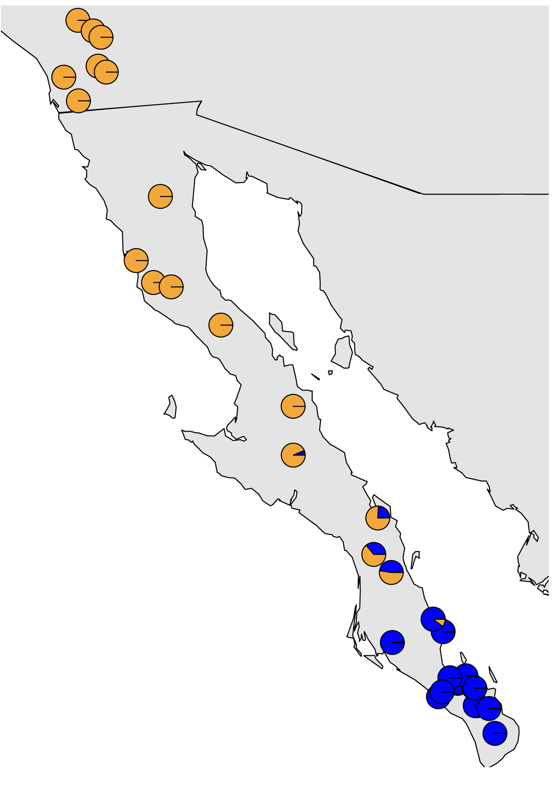

## Table of Contents

- [1. Introduction](#introduction)

- [2. Population structure](#population-structure)

- [3. Inferring selection](#inferring-selection)

      
      
      
      
      
      
      
      
      

## 1. Introduction

So far, we have explored have processed our data to get it from the raw reads that we generally start with into aligned data where our files are now sequences of SNPs or loci that are on a common coordinate system for each individual sample. This allows us to now make inferences based on variation at sites in the alignment across samples. The two types of analyses that we will aim to cover in the final two sessions of the workshop are population structure analysis and inference of selection. We will briefly introduce these conceptually here so that we can dive into these in the coming weeks.

   

## 2. Population structure

Population assignment is a critical step in many population genetic and phylogeographic studies. Most downstream methods for estimating gene flow, divergence, population size, and other interesting population parameters require populations to be specified by you as inference program input. If you have population structure in your data that you have not adequately accounted for, this can bias many types of analyses. E.g., if you try to estimate the history of population size changes in a group of samples that you assume are a single population when they actually come from multiple discrete populations, this will bias your results.

There are multiple ways to assign individuals to discrete populations. In some cases, you may have a priori ideas about population boundaries based on geographic discontinuities, differences in morphology across a species range, previous genetic data, or other sources of information. However, most of the time you will want to infer the number of populations and population membership of individuals directly from your data. This is essentially a classification problem: we are seeking to classify our whole set of genetic samples into a number of populations, often while also seeking to determine how many populations are present.

One of the most commonly used programs for the inference of population structure is the aptly named program [Structure](https://web.stanford.edu/group/pritchardlab/structure.html). Structure is a model-based clustering method that seeks to split individuals into clusters such that linkage disequilibrium is minimized and Hardy-Weinberg equilibrium is maximized within each cluster. Structure us a Bayesian method that relies on Markov chain Monte Carlo (MCMC) sampling, and can thus become somewhat unwieldy with large datasets. Many fast alternatives have been developed since the advent of Structure, including [Admixture](https://dalexander.github.io/admixture/) which utilizes the same model from Structure, but in a faster maximum likelihood implementation. Other alternative approaches do not explicitly model Hardy-Weinberg equilibrium or linkage disequilibrium, including the sNMF appraoch implemented in the [LEA R package](http://membres-timc.imag.fr/Olivier.Francois/LEA/files/LEA_github.pdf) and DAPC as implemented in the [Adegenet R package](https://github.com/thibautjombart/adegenet). All of these methods often produce comparable results, which are often visualized as barplots of the estimated membership of each sample in one or more population clusters or as pie charts of the same information plotted onto a map as show in the figures below.

If using DAPC to estimate population membership, it is important to note that in my experience, with large amounts of data, DAPC is very good at estimating which population a sample belongs to, but if a sample is admixed, it will be confidently placed into the population that it shares the most ancestry with. Barplots or pie charts of DAPC reflect the uncertainty in classification rather than amount of admixture, so care should be taken not to interpret DAPC plots the same way as plots from Strucure, Admixture, sNMF, etc.

An additional critical consideration is that  continuous spatial genetic structure across the range of a population can be highly problematic for population structure methods. One of the most common types of continuous spatial structure is isolation by distance (IBD), which occurs when dispersal is limited and individuals that are geographically closer are more related than individuals that are geographically distant. If IBD is strong enough, population structure methods can incorrectly infer the presence of multiple discrete populations with a gradient of admixture between the farthest individuals. This problem is reviewed well in [Bradburd et al. 2018](https://academic.oup.com/genetics/article-abstract/210/1/33/6088031) and they developed the method conStruct to simultaneously continuous and discrete spatial structure. The program can be finicky, particularly with regards to missing data, so we won't use it in the workshop, but it is a powerful tool. In any case, testing to isolation by distance and being aware of its potentially misleading effects can help to prevent incorrect inferences of population structure.

   

## 3. Inferring selection

