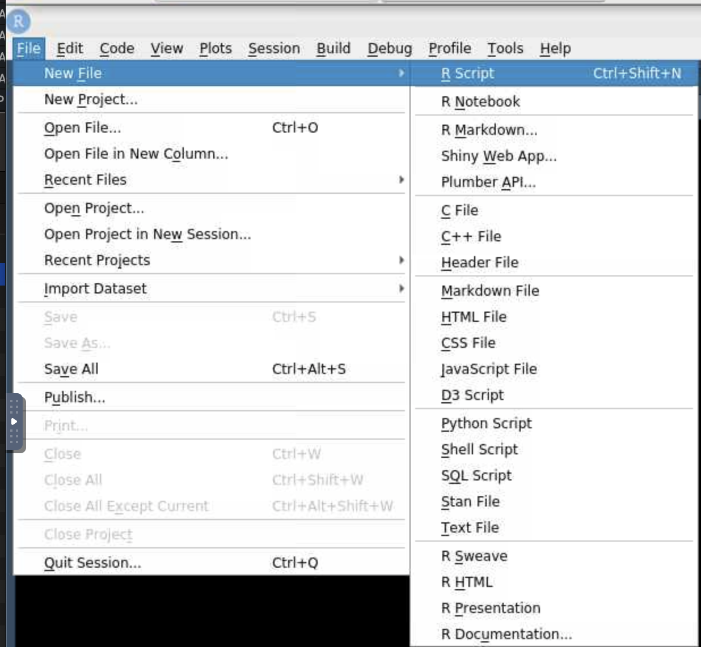
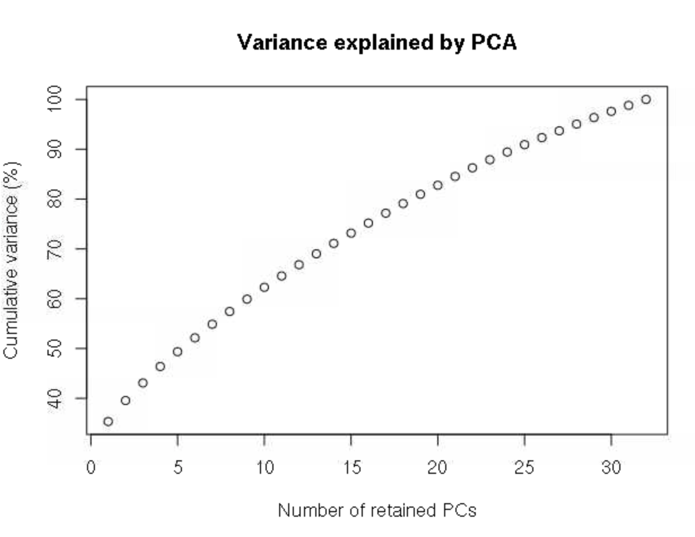
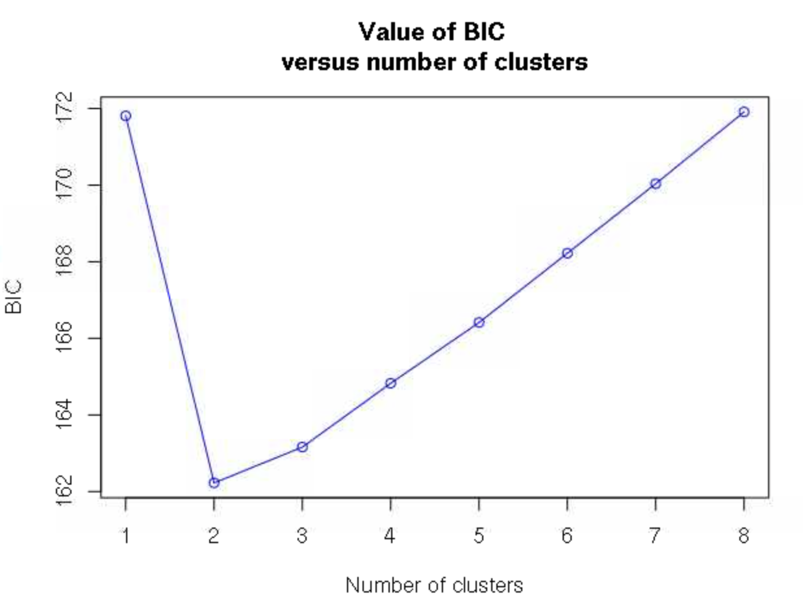
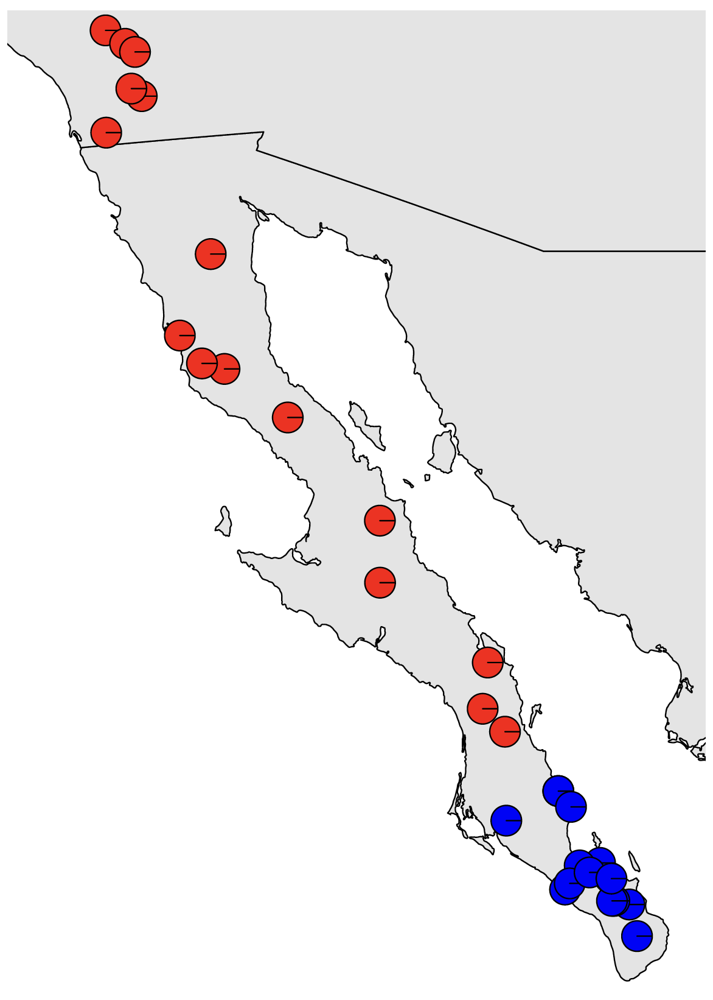
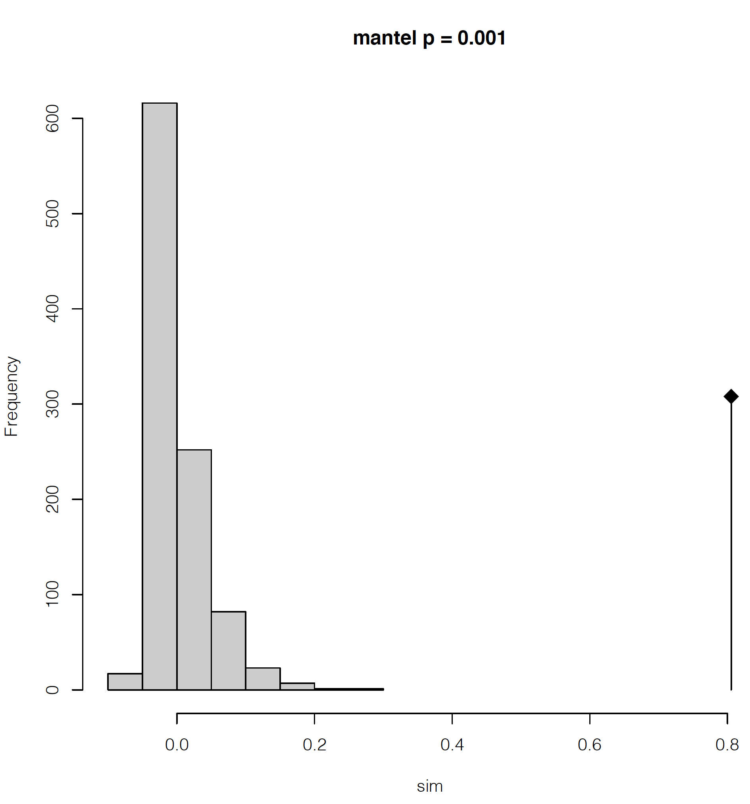
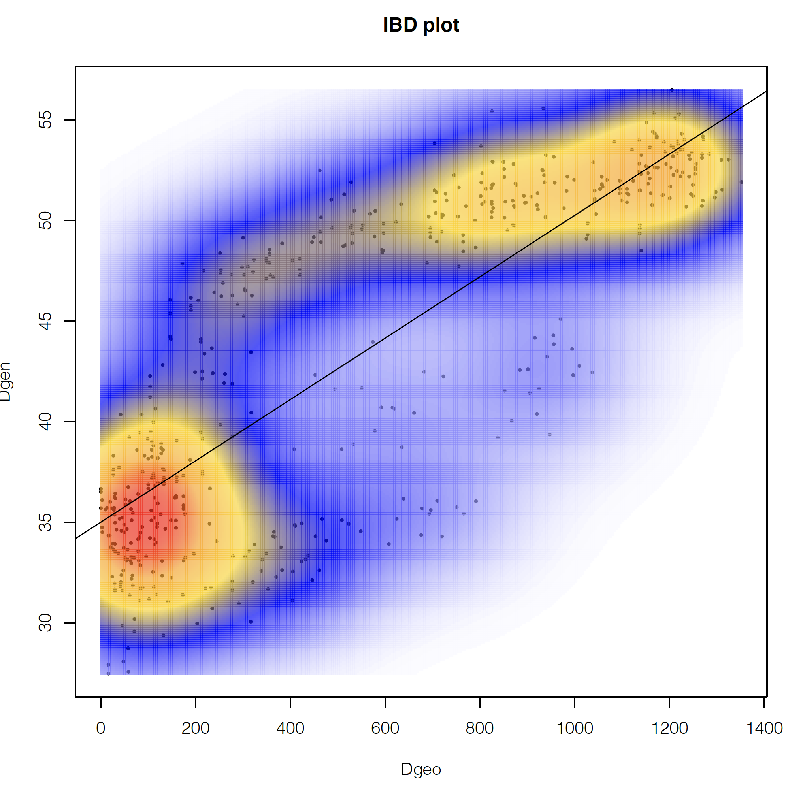
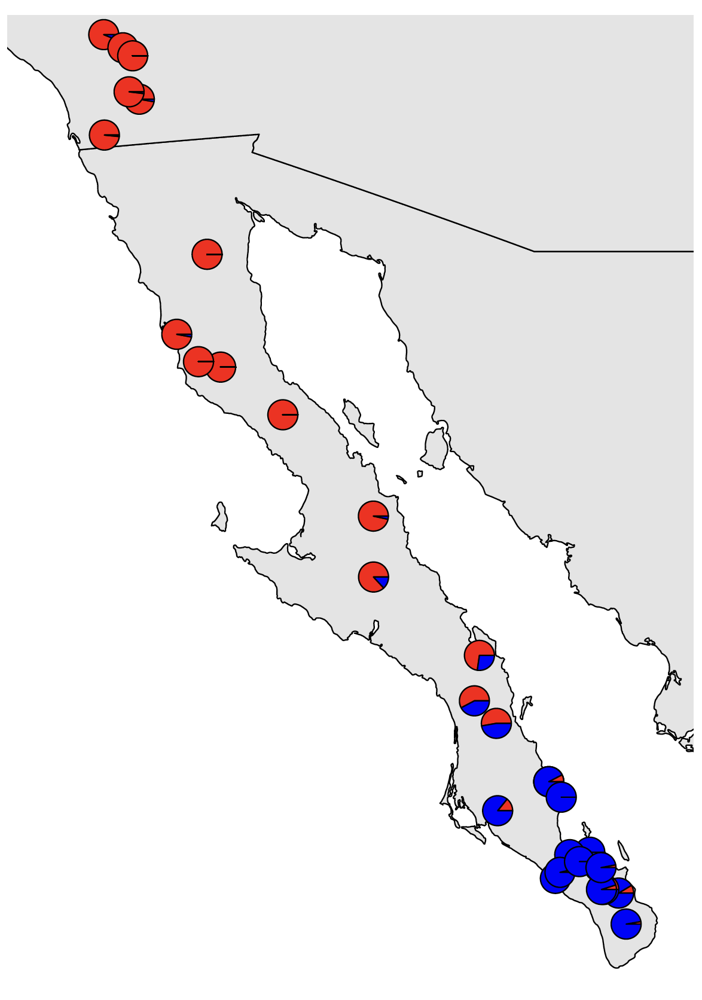

## Table of Contents


- [1. RStudio on Teton](#rstudio-on-teton)

- [2. RStudio setup](#rstudio-setup)

- [3. Discriminant analysis of principal components](#discriminant-analysis-of-principal-components)

- [4. Isolation by distance](#isolation-by-distance)

- [5. sNMF](#snmf)


<br><br><br><br><br><br>
<br><br><br><br><br><br>
<br><br><br><br><br><br>
<br><br><br><br><br><br>
<br><br><br><br><br><br>
<br><br><br><br><br><br>
<br><br><br><br><br><br>
<br><br><br><br><br><br>
<br><br><br><br><br><br>


## 1. RStudio on Teton


We'll now use some methods in R to further explore the population structure in our data. There a few different ways to run R code on Teton. The simplest is to simply load up an R module in a regular Teton session and use it as an interactive terminal. Another way is to create an R script, then execute that script with the Rscript command on Teton. Finally, you can RStudio to simultaneously develop a script and execute code simultaneously. This final option is by far my preferred method unless I already have a script that I am confident will run without errors and without interactive input or tuning or if my computational needs exceed the resources currently allocated for RStudio on Teton.

To do this we'll use the new and super cool SouthPass interface that ARCC has recently made available. You can access SouthPass at **[https://southpass.arcc.uwyo.edu]( https://southpass.arcc.uwyo.edu)**. This will take you to a Wyo Login page, use your regular UW username and password to log in.


This should taker you to a screen that includes options that look like this:

<center>


</center>


These are various ways to interface with Teton. We won't get into what these all do, today we'll just use `Teton Xfce Desktop`. When you click on that icon, it will take you to a page that asks you to specify your project/account (this is the project that you put in when run an `salloc` session or in a slurm joib script).

We'll select `2 hours` and `2 CPU, 8GB memory` for our Desktop Configuration.

Then click launch. This should start quickly (hopefully the system is brand new, so we'll be some of the first testers running several sessions at once). This will go to a new page that will show the job as queued briefly, then you should see the option `Launch Teton Xfce Desktop` show up. Click that to start the session. 

This will start up an interactive desktop session. This will look like a standard desktop, but you are running on a Teton compute node. To start up RStudio, open up the terminal emulator (either in the bottom bar or Applications in the top right) 

In the terminal emulator, load the RStudio module and then start up RStudio

```
module load swset gcc r/4.0.5-py27 rstudio/1.4.1106
rstudio &
```

The `&` will push the RStudio process to the background so that we can continue to type other commands into the terminal while RStudio is running. You should now have an open RStudio window. This will look just like RStudio would on your local computer. 


## 2. RStudio setup

As is typical, let's start by making sure we know where our files are. We'll use the output from ipyrad. To make sure everyone is on the same page, let's all copy over the files again. Copy these to wherever you want (gscratch or your project directory) and keep track of the path to these files, we'll need this path inside of R.

In a Teton terminal, either the terminal inside your SouthPass session or a regular Teton session, navigate to where you want to have the data and run:


```
cp -r /project/inbre-train/2021_popgen_wkshp/week_1_ipyrad_output/ipyrad_out/ruber_reduced_ref_outfiles .
``` 

This directory also has the localities file that we will need.

From here on, we'll work in RStudio. Go back to your RStudio window and open up a new R script:


<center>


</center>


Use the same file menu to save the file as whatever you'd like, I'll save mine as `ruber_popstruct.R`. You should now have 4 panes in your RStudio session, a script, a terminal, and two other panes that include a file navigator, environment viewer, plot viewer, etc. We don't have time to get into all of the features of RStudio now, but it's a very useful tool.


We're now ready to start scripting in R. We'll enter all of our code into the script so that we can save everything. We can then run the code from the script by hitting `ctrl+enter` or `command+enter` on the line we want to run or on a whole block of code that we select. We can also use the `Run` button at the top of the script window instead of `ctrl+enter` or `command+enter`.


Let's start by installing the packages that we will need.


```r
install.packages(c("adegenet", "plotrix", "mapdata", "rworldmap", "BiocManager", "vcfR", "fossil"))
BiocManager::install("LEA")
```

This may take a minute or two. Once that's done, we can load up the packages.

```r
### load up relevant packages
library(adegenet)
library(LEA)
library(plotrix)
library(mapdata)
library(rworldmap)
library(vcfR)
library(fossil)
library(MASS)
```


Then we will specify a number of file paths and read in a few files so that we don't have to repeatedly hardcode file paths farther down in the script. This makes it easier to reuse the script on different datasets or the same data with different filtering schemes without having to search through the script for every time an absolute file path is specified.


```r
## Set up an object containing the path to the data
data_dir <-
	"/home/sharrin2/inbreh/2021_10_popgen_wkshp/week4_dev/ruber_reduced_ref_outfiles"

setwd(data_dir) # set that as our working directory


## make a directory to put the output plots into
##    this can be wherever you like, I'm putting it into the directory that contains
##    my ruber_reduced_ref_outfiles directory
out_dir<-"/home/sharrin2/inbreh/2021_10_popgen_wkshp/week4_dev/Pop_structr_out"
if(!dir.exists(out_dir)){ # check if the directory  exists
  dir.create(out_dir)   # and create it if it does not
}


# Set up an object that contains the base file name of files in the output directory. 
#    Data files are all this basename with varying extensions
#  we won't call this 'basename' because that is a function in R
basefile <- "ruber_reduced_ref"


# Read in the coordinates for plotting later
coords<-read.csv("Localities.csv", header=TRUE, row.names=NULL)


####################################################################################
## Set up paths to input files using the base file name specified above
####################################################################################
path_ugeno<-paste0(data_dir,"/", basefile,".ugeno")
path_ustr<-paste0(data_dir,"/", basefile,".ustr")
path_vcf<-paste0(data_dir,"/", basefile,".vcf")

### Set up some colors for plotting farther down
colors_2<-c("red", "blue") # colors for plotting 2 populations
```


## 3. Discriminant analysis of principal components


We're now ready to start reading in the data and analyzing it. We'll start with discriminant analysis of principal components, or DAPC, a method of classifying individuals into clusters that does not include any explicit population genetic model. 

We'll use the unlinked Structure-formatted file for this, but because Structure-formatted files can come in a variety of different configurations, we need to tell the function how many individuals and loci are present in the file. The easiest way I've so far come up with to do this is to first read in the `ugeno` file and use the dimensions of that file to get the number of individuals and snps.

```r
# read in the geno file to get the number of individuals and snps for this assemblydon't 
geno_txt<-readLines(path_ugeno)
nums_snps<-length(geno_txt) # the number of lines is the number of loci
num_ind<-length(strsplit(geno_txt[[1]], "")[[1]]) # the number of columns is the number of
     # individuals - here we split apart the first line into individual characters and
     # count the length
```

Then we can read in the Structure file.

```r
# A quirk of read.structure function is that it requires the strucure file to have the
#     file extension ".stru" - do some copying to make a new file with this extension

# Use a regular expression substitution to generate the new file name
path_stru<-gsub(".ustr", ".stru", path_ustr)
file.copy(path_ustr, path_stru) # make a copy of the file with the new name

# Now we can finally read in this file
DAPC_ustr<-read.structure(path_stru, n.ind=num_ind, n.loc=nums_snps, onerowperind = FALSE, col.lab=1, col.pop=0, NA.char="-9", pop=NULL, ask=FALSE, quiet=FALSE)

# get the individual names in the order that they show up in the various files - this is
# important farther down for getting coordinates into the right order for plotting
ind_names<-rownames(DAPC_ustr@tab)
```

Take a quick look at how the data is structured for Adegenet

```r
DAPC_ustr
```

Now we can run DAPC. We start by determining how many clusters we want to use. We'll test up to 8 clusters, which should be overkill. If the best fit turned out to be 8, we'd want to expand our maximum number of clusters to ensure that we aren't artificially limiting the number of clusters that our data can fall into. 

```r
grp <- find.clusters(DAPC_ustr, max.n.clust=8)
```

This will first spit out a plot of variance by each principle component in the PCA transformation of the data. We want to retain all PCs up to the point at which the cumulative variance plateaus. There is no clear plateau here, so we'll retain all PCs, which is 32 here. 

<center>


</center>


```r
32 # this has to be entered into the R terminal
```

We are then asked how many clusters we want to retain, with the fit of each number of clusters estimated by Bayesian information criterion. Here, 2 clusters is clearly a much better fit (lower BIC) than any other values. 

<center>


</center>


```r
2  # again enter this into the R terminal, not the script 
```

Note that in some cases, the number of clusters will not be as clear, and you will have to look for an inflection point of where there is the sharpest decrease in BIC as clusters increase rather than the single cluster with the lowest BIC.

The grp object now contains the groupings of these individuals into the 2 clusters we decided one, and we can use the function dapc to describe these groups.


```r
dapc1 <- dapc(DAPC_ustr, grp$grp) # run DAPC
```

We will again get asked how many PCs to retain, and we'll specify 32 again.

```r
32
```

We will then be asked how many discriminant functions to retain. With only 2 groups, only 1 is possible, and we'll select 1.

```r
1
```

We can now use our `dapc1` object to plot out our confidence in assigning individuals to each of the groups. 


```r
## plot the DAPC the ugly way
scatter(dapc1, col=colors_2,  bg="white",
        legend=FALSE, posi.da = "bottomright",
        solid=.5
)

# another way
assignplot(dapc1)

# bar chart
compoplot(dapc1, posi="bottomright",
          txt.leg=paste("Cluster", 1:length(grp$size)), lab="",
          n.col=1, xlab="individuals")
```

None of these plots mean too much to me, other than showing that we have very little uncertainty about which cluster each individual falls into. We could add the individual IDs to the bottom of that last plot, but I can't keep track of which individual is from where, and I really want to know what the spatial pattern looks like. To do this, let's plot it out to a map.


We'll first do a little processing of the coordinates (remember that we read these into R earlier) to make sure that the coordinates are in the right order and that every individual we want to plot has locality data.


```r
## make sure there aren't any individuals that don't have coordinates
ind_names[which(!ind_names %in% coords[,"Field.No."])]

# match up the coordinates to the order of the individuals from genetic data
match_coords<-match(ind_names, coords[,"Field.No."])
coords<-coords[match_coords,]
```

Then we can plot out a map

```r
# Plot out the map
map("worldHires", "Mexico", xlim=c(-118,-109), ylim=c(22,34),col="gray90", fill=TRUE)
map("worldHires", "usa", xlim=c(-118,-109), ylim=c(22,34), add=TRUE,col="gray90", fill=TRUE)
```

and add on pie charts showing the probability of membership in each cluster for each sample

```r
# Plot pies at each locality
for (x in 1:nrow(coords)) {floating.pie(coords$Longitude[x],coords$Latitude[x],
	c(dapc1$posterior[x,1], dapc1$posterior[x,2]), radius=0.1, col=colors_2)}
```

This doesn't look awesome in the RStudio plot viewer, but will look much better if we write it to a pdf:

setwd(out_dir) # set the working directory to where we want to write the output

```r
pdf(file="DAPC_Map.pdf", width=10, height=10) # open the pdf plotting device
  # Plot out the map
  map("worldHires", "Mexico", xlim=c(-118,-109), ylim=c(22,34),col="gray90", fill=TRUE)
  map("worldHires", "usa", xlim=c(-118,-109), ylim=c(22,34), add=TRUE,col="gray90", fill=TRUE)
  
  # Plot pies at each locality
  for (x in 1:nrow(coords)) {floating.pie(coords$Longitude[x],coords$Latitude[x], 
		c(dapc1$posterior[x,1], dapc1$posterior[x,2]), radius=0.2, col=colors_2)}
dev.off() # close the pdf plotting device
```

This should look nice. We can see a very clear genetic break in southern Baja California. However, because this is a classification problem and isn't explicitly modeling admixture, we only see the confidence with which each sample is assigned to each cluster. I.e., this does not indicate that there is no evidence of admixture among populations. Our results from Structure will show us that. We can also use the method sNMF, which is included at the end of this tutorial, but that we will most likely not get to go through as a group.


<center>


</center>


## 4. Isolation by distance

As we mentioned at the end of last week, if isolation by distance (IBD) exists in our dataset, programs that seek to cluster individuals but do not model continuous spatial structure can be positively misled by IBD. This can result in overestimating the number of population clusters, potentially identifying discrete population structure when no such structure exists. We mentioned that the method conStruct can explicitly model both processes, but can be finicky to run and have long run times.

Here, we'll do a quick test and visualization of isolation by distance to try to determine if IBD is misleading our population structure analyses.


We need our data in a different format, so we'll start by reading in our vcf file.


```r
gendata_all<-read.vcfR(path_vcf) # read in all of the genetic data
gendata<-vcfR2genlight(gendata_all) # make the genetic data a biallelic matrix of alleles in genlight format
```

We'll start off by running a Mantel test, which correlates two different distance matrices. We'll need to convert our DNA and geographic data into pairwise distances for this test:


```r
Dgen<-dist(gendata) # get the genetic distances
Dgeo<-earth.dist(coords[,c("Longitude", "Latitude")]) # get the geographic distances
```


Then run the test:

```r
ibd<-mantel.randtest(Dgen,Dgeo) # run the mantel test
```

We can then visualize the result of our empirical estimate of isolation by distance compared to a permuted null distribution to see how significant our result is. We'll also plot out a kernel density plot of genetic vs. geographic distances to visualize how these distances are associated.

```r
## PDF of mantel output and a kernel density plot of genetic vs. geograophic distance
pdf(file="Mantel_KD.pdf", width=8, height=8)
plot(ibd, main=paste0("mantel p = ", ibd$pvalue)) # plot out the IBD significance

## make kernel density plot of genetic and geographic distances
dens <- kde2d(as.numeric(Dgeo),as.numeric(Dgen), n=300)
myPal <- colorRampPalette(c("white","blue","gold", "orange", "red"))
plot(Dgeo, Dgen, pch=20,cex=.5)
image(dens, col=transp(myPal(300),.7), add=TRUE)
abline(lm(as.numeric(Dgen)~as.numeric(Dgeo)))
title("IBD plot")
dev.off()
```


This will make a 2-page pdf of these plots. Looking at the first page, we can see that we have highly significant isolation by distance, with the lowest possible significance value given our number of permutations in the Mantel test (999 by default). The diamond-shaped point with the line indicates our empirical estimate, with the permutations shown as the gray histogram.

<center>


</center>


If we look at the second page, we can see how the geographic and genetic distances are correlated. What we see is a positive relationship, but with a major disjunction. This type of disjunction indicates the presence of some level of not fully continuous spatial genetic structure. 

<center>


</center>


If we had only pure IBD, we would expect a single, roughly linear cloud of points. We won't reproduce this here, but when looking at only the northern population, we find a pattern that looks much more like pure IBD.

<center>


</center>


These plots can help reassure us that there is IBD in the data, but some kind of discrete structure across the whole species, which is what we are detecting with DAPC, etc., but no further discrete structure within the northern population. 


## 5. sNMF

It is unlikely that we will have time to cover this together, but I'm including it here for reference because my preferred method of population clustering is to use a combination of sNMF and DAPC. I like to use sNMF rather than Structure because it's very fast and produces results highly similar to Structure. sNMF can have trouble with samples that have high amounts of missing data, though, with high missing data causing individuals to appear to be admixed. In such cases, the estimates of admixture that you get out of Structure or Admixture may be better than those from sNMF.


The snmf function requires a `geno` file as input, and requires that it has the extension `.geno`. We want to use only unlinked SNPs here (i.e., 1 SNP per RAD locus, assumed to be unlinked), and the geno file of unlinked snps has the extension `ugeno`, so we'll copy the file and give it a new extension:

```r
# Use a regular expression substitution to generate the new file name
path_geno<-gsub(".ugeno", ".u.geno", path_ugeno)

file.copy(path_ugeno, path_geno) # do the copying with the new name
```

Now we're ready to run sNMF. We'll run this using 1 to 10 possible ancestral populations and evaluate the fit of these different numbers of populations (referred to as k values) to the data using the cross entropy criterion.


```r
obj.at <- snmf(input.file = path_geno,  # input file is the .geno format file
               K = 1:10, # we will test for k=1 through 10
               ploidy = 2, 
               entropy = T, # use the cross entropy criterion for assessing the best k 
               repetitions = 10, # Run 10 independent replicate analyses
               CPU = 2, 
               project = "new", tolerance = 0.00001, iterations = 500)
```


Let's make a pdf of the cross-entropy plot


```r
pdf("snmf_cross_ent.pdf", width = 8, height=5)
  plot(obj.at, col = "lightblue", cex = 1.2, pch = 19)
dev.off()
```

As for DAPC, the best fit model is one with 2 populations, as shown by the lowest cross-entropy score. We can also look at a numeric summary of this result:

```r
outstats <- summary(obj.at)
outstats
```

We can also confirm cross entropy values for K are consistent across runs and get the single best run for K=2.

```r
ce <- cross.entropy(obj.at, K = 2) 
ce # pretty similar
best.run <- which.min(ce) # find the run with the lowest cross validation error
```

Then we can get the snmf Q matrix from the best run at the best k, which is a matrix of the proportion of ancestry that each sample derives from each population.

```r
qmatrix <- Q(obj.at, K = 2, run = best.run)
admix<-as.data.frame(qmatrix)
```


And finally we can plot this out onto a map like we did for our DAPC results:


```r
pdf(file="sNMF_Map.pdf", width=10, height=10) # open the pdf plotting device
  # Plot out the map
  map("worldHires", "Mexico", xlim=c(-118,-109), ylim=c(22,34),col="gray90", fill=TRUE)
  map("worldHires", "usa", xlim=c(-118,-109), ylim=c(22,34), add=TRUE,col="gray90",
  	fill=TRUE)

  # Plot pies at each locality
  for (x in 1:nrow(coords)) {floating.pie(coords$Longitude[x],coords$Latitude[x],
            c(admix$V1[x],admix$V2[x], admix$V3[x]), radius=0.2, col=colors_2)}
dev.off() # close the pdf plotting device
```


<center>


</center>


The majority population membership matches up with what we saw from DAPC, but we are now able to see the admixture present where the populations contact each other.


