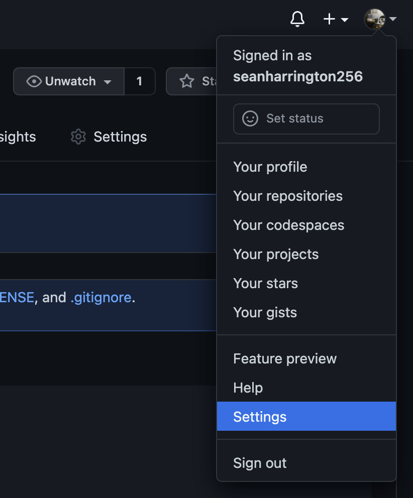
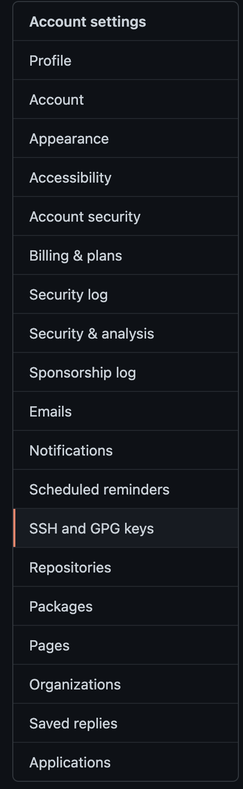
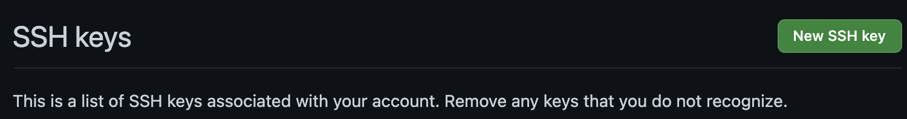

## Table of Contents


- [0. What are Git and Github?](#what-are-git-and-github)

- [1. Create a Github account and repository](#create-a-github-account-and-repository)

- [2. Git on Teton](#git-on-teton)

- [3. Configuring and pushing to Github](#configuring-and-pushing-to-github)


<br><br><br><br><br><br>
<br><br><br><br><br><br>
<br><br><br><br><br><br>
<br><br><br><br><br><br>
<br><br><br><br><br><br>
<br><br><br><br><br><br>
<br><br><br><br><br><br>
<br><br><br><br><br><br>
<br><br><br><br><br><br>


## 0. What are Git and Github?

Git is open source version control software. Version control is the general name for a system that tracks incremental changes made to code or other documents (e.g., these tutorials). In addition to keeping track of any changes made to the code or other document, Git will also allow users to revert to previous versions of a document. This capability allows you to make changes to your code without fearing that the new changes will break the whole pipeline: if that happens, simply revert to that last functional version. The eliminates the need to keep around old versions of code as separate files "just in case" or to have multiple versions of the same code that are hard to keep track of. Git is not the only version control program, but it is the most widely used and integrates seamlessly with a number of remote systems and other tools.

Github is a an online Git repository hosting service. Github is integrated with Git to allow for easy sharing of Git repositories, collaboration on projects, and even hosting of websites, such as the website for this workshop. If you go to [https://github.com/wyoibc/popgen_workshop](https://github.com/wyoibc/popgen_workshop), you can see the raw repository for this workshop, including information about the changes made to files, etc.

<br><br><br>

## 1. Create a Github account and repository

We'll work with Git on Teton, where it is already installed. If you want to use it locally on your own machine, Git should also come installed on Mac and Linux operating systems, but will [need to be installed on Windows](https://gitforwindows.org/). So we just need to set up Github and then we can get working. 

If you do not already have a Github account, go to [Github](https://github.com/) and click on `Sign up` in the top righthand corner and complete the process of creating your account. While signed in, you should see a `+` button in the righthand corner. Click on that and select `New Repository`. This should open a page that looks like this:


<center>

</center>

In `Repository name` enter `popgen`. In `Description`, you can enter something like `Repo for 2021 Popgen workshop`. Below `Description`, change the repository from `Public` to `Private`. For any data and code that you actually want to make public, you will leave this checked as `Public`, but we're all uploading more or less the same files to Github in different repositories, so these repositories don't need to be publicly available.

You should now have an empty Github repository. We'll use Git on teton to add the contents of this repository.

<br><br><br>

## 2. Git on Teton


We have organized our files **terribly** throughout this workshop. A much better sytem would have been to plan ahead (you should always do this with your own data and code) and create a directory for our various scripts, a directory that contains data, and a directory that contains figures and other output. We could have subdirectories within each of these or some modification of this, but minimally, separating out the data from everything else is very useful. Unfortunately, moving around among these directories as a group gets tricky when we all have different paths, as on Teton.

For now, since we all have various files and data strewn all over, let's get on the same page by adding yet another directory of files to the mix. Let's all copy over a set of files to work with to wherever you are working from on Teton and then change into this directory:

```bash
cp -r /project/inbre-train/2021_popgen_wkshp/popgen .
cd popgen
```

Then we'll initialize our Git repository. This allows us to start tracking changes inside this repository.

```bash
git init
```

We already have some data in here, so now we'll just make a readme file. This will explain what's in this repository and will be displayed on the Github page for this repository once we upload to there. We'll make this as a markdown file. This is just a type of text file that allows for some other types of formatting and can be easily converted to HTML.

```bash
nano README.md 
```

in this newly created and opened file, we'll type our readme information:

```bash
---
title: C. ruber popgen
author: Sean Harrington
date: December 3, 2021
---

This repo contains scripts used to analyze RADseq data for the red diamond rattlesnake, Crotalus ruber

<center>

</center>
```

Then close and save the file (`ctrl + x` then `y` in nano). This file now contains a standard markdown preamble, some information about the repository, and a picture of a cool rattlesnake.


So now we have initialized our Git repository and it has all of the files in it that we want. However, still have to tell Git to add these files (and any changes to them) to what it is tracking. We do this with

```bash
git add .
```

The `.` is the same shortcut we've used before, and indicates the current directory, so this will add all files in the current directory to Gits memory of files to track. We can use

```bash
git status
```

to see the status of changes in the repository and see that there are changes ready to be committed. We can commit these to the repository and get them ready to push to our Github repository by running

```bash
git commit -m "initial commit"
```

The `-m` argument specifies the message that accompanies the commit, and can be anything, although you should strive for something short but informative about the changes you made.

<br><br><br>

## 3. Configuring and pushing to Github

We're now ready to push our repository to Github, but first we need to do some configuration to set this up. 

If you are working on Teton, the first step is to make sure that you own your `~/.ssh` directory, if you do not, you will need to email ARCC (arcc-info@uwyo.edu) and have them transfer ownership of that directory to you. You can check the ownership by running `ls -ld ~/.ssh`. You should see a series of letters and a number followed by your username twice if you own the directory or followed by `root` twice if the directory is owned by root. If you own the directory, we're good to continue on.


We need to start by generating an ssh key pair that will allow our computer (or Teton in this case) to securely interact with Github. To create the ssh key pair, run the following, substituting your own email address.

```bash
ssh-keygen -t rsa -b 4096 -C "YOUR_USERNAME@uwyo.edu"
```

This should then ask you what file you want to save this as. I'm saving mine as `/home/YOURUSERNAME/.ssh/github_key` - edit this to include your username.

Then it will ask you for a passphrase, which you can leave empty by just hitting enter both times when prompted. I'm not using a passphrase here, but you can if you want, just make sure to remember it, as you'll be asked for it when you use the key.

Now we need to go copy the public key so that we can associate it with out Github account. I use `less /home/YOURUSERNAME/.ssh/github_key.pub` to look at the key and copy it (`q` quits less). Make sure you're copying the **public key**, ending in .pub, not the private key.


On Github, in the top right, go to `Settings`

<center>

</center>

then in account settings, select `SSH and GPG keys`


<center>

</center>


and then click on `New SSH key`


<center>

</center>

Copy your public key into the `key` box and give it a title, then click `Add SSH key`. The key is now added to Github.


Now we have to configure our system (Teton here) to use the ssh keys.

```bash
ssh-add /home/YOURUSERNAME/.ssh/github_key # add the key
ssh-add -l # make sure the key is being used
```

The key should be listed after running that second command.

If the former commands do not work and you get an error like `could not open a connection to your authentication agent`, it most likely means that the ssh-agent is not running. In that case, run 

```
eval `ssh-agent`   # only necessary if the previous commands did not work
```


Now we can create a config file in our .ssh directory (or edit it, if it already exists) to complete the setup.

```bash
nano /home/YOURUSERNAME/.ssh/config
```

add the following to the file (**edited for your own usernames**), then save and close it:


```bash
Host *
   AddKeysToAgent yes
   IgnoreUnknown AddKeysToAgent,UseKeychain
   UseKeychain yes

Host YOURGITHUBUSERNAME.github.com
        HostName github.com
        User git
        PreferredAuthentications publickey
        IdentityFile /home/YOURUSERNAME/.ssh/github_key
```

We also need to change the permissions on this file.

```bash
chmod 600 ~/.ssh/config
```


Now we just need to associate the remote Github repository with this local (Teton) repository. If you are not already in your `popgen` directory that we made earlier, navigate back to it now:

```bash
cd /Your/Path/to/popgen
```

Then configure the repository with your information:

```bash
git config user.name "YOUR_GITHUB_USER_NAME"
git config user.email "YOUR_GITHUB_EMAIL_ADDRESS"

git config --list

git remote add origin git@github.com:YOUR_GITHUB_USERNAME/popgen.git
```

You should now be ready to push to the remote repository.

```bash
git push -u origin master
```


If that ran successfully, you should be able to use a browser to go look at your repository on Github and see that it contains the content in our local repository on Teton, with the readme file displayed below the list of files.

This will allow you to publicly share your code and results but Github also has many other functions that enable easy collaboration on projects. We don't have time to dig into these, but if you go to the IDSC's [Summer of Code website](https://wyoibc.github.io/soc2021/) from this past summer, Vikram has put together several nice tutorials on more advanced uses of Github.


