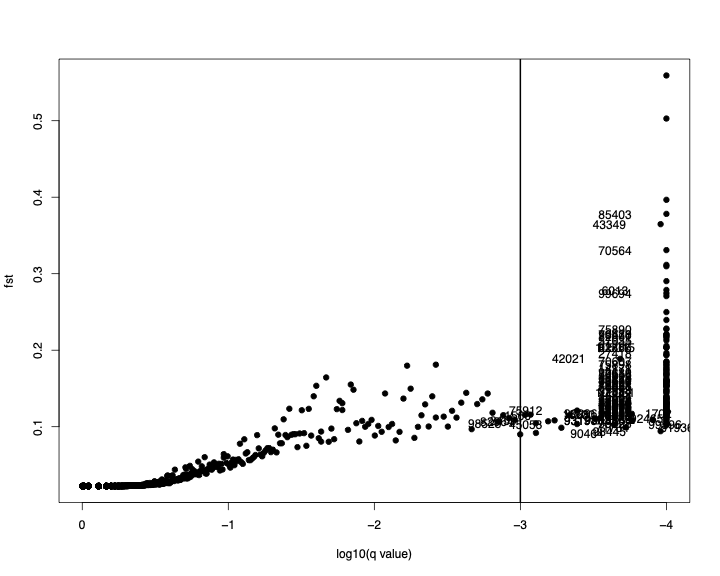

## Table of Contents


- [1. Preparing Input File](#preparing-input-file)

- [2. Run Bayescan](#run-bayescan)

- [3. Understanding Bayescan Output](#understanding-bayescan-output)

- [4. Visualizing Outliers](#visualizing-outliers)

<br><br><br><br><br><br>
<br><br><br><br><br><br>
<br><br><br><br><br><br>
<br><br><br><br><br><br>
<br><br><br><br><br><br>
<br><br><br><br><br><br>
<br><br><br><br><br><br>
<br><br><br><br><br><br>
<br><br><br><br><br><br>


## 1. Preparing Input File

The file conversion will be similar to how we did it for Structure using ``PGDSpider``. We need the following files:

- Population file (``ruber.pop``)

- PGDSpider template file (``vcf2bscan.spid``)

- Input VCF file (``ruber_reduced_ref.vcf``)


You can copy these files from: ``/project/inbre-train/2021_popgen_wkshp/data/Bayescan``.  Copy all files from this folder.


```bash

cd /path/to/your/gscratch/folder

cp /project/inbre-train/2021_popgen_wkshp/data/Bayescan/data/* .


ls -lh

-rw-rw-r-- 1 vchhatre  670 Dec  2 10:56 crovir.pop
-rw-r--r-- 1 vchhatre  336 Dec  2 10:57 vcf2bscan.sh
-rw-r--r-- 1 vchhatre 1.5K Dec  2 10:57 vcf2bscan.spid
-rw-rw-r-- 1 vchhatre 2.6M Dec  2 10:58 ruber_reduced_ref.vcf

```


<br><br>


### 1.1 Exclude Loci with More than 2 Alleles

You might recall that the VCF file contains some loci with more than 2 alleles. We need to exclude those loci from further analysis because they violate the assumptions of the method (Bayescan) we are about to use.

- First, run a check on the vcf file:


```bash
module load gcc swset perl vcftools

vcftools --vcf ruber_reduced_ref.vcf

VCFtools - 0.1.14
(C) Adam Auton and Anthony Marcketta 2009

Parameters as interpreted:
	--vcf ruber_reduced_ref.vcf

After filtering, kept 33 out of 33 Individuals
After filtering, kept 4562 out of a possible 4562 Sites
Run Time = 0.00 seconds

```


- Then check for loci that have exactly two alleles

```bash

vcftools --vcf ruber_reduced_ref.vcf --min-alleles 2 --max-alleles 2

VCFtools - 0.1.14
(C) Adam Auton and Anthony Marcketta 2009

Parameters as interpreted:
	--vcf ruber_reduced_ref.vcf
	--max-alleles 2
	--min-alleles 2

After filtering, kept 33 out of 33 Individuals
After filtering, kept 4502 out of a possible 4562 Sites
Run Time = 0.00 seconds

```

- So it appears that there are about 60 sites with more than 2 alleles. Let's exclude those.


```bash

vcftools --vcf ruber_reduced_ref.vcf --min-alleles 2 --max-alleles 2 --recode --out ruber_4502snp

VCFtools - 0.1.14
(C) Adam Auton and Anthony Marcketta 2009

Parameters as interpreted:
	--vcf ruber_reduced_ref.vcf
	--max-alleles 2
	--min-alleles 2
	--out ruber_4502snp
	--recode

After filtering, kept 33 out of 33 Individuals
Outputting VCF file...
After filtering, kept 4502 out of a possible 4562 Sites
Run Time = 0.00 seconds


```

- Check to make sure it worked:


```bash

vcftools --vcf ruber_4502snp.recode.vcf 

VCFtools - 0.1.14
(C) Adam Auton and Anthony Marcketta 2009

Parameters as interpreted:
	--vcf ruber_4502snp.recode.vcf

After filtering, kept 33 out of 33 Individuals
After filtering, kept 4502 out of a possible 4502 Sites
Run Time = 0.00 seconds


```

- Good!  Let's quickly rename this file to shorten its name:


```bash
mv ruber_4502snp.recode.vcf ruber_4502snp.vcf
```


<br><br>

### 1.2 Check Popfile


```bash
vim crovir.pop

SD_Field_0201   north
SD_Field_0255   south
SD_Field_0386   south
SD_Field_0491   south
SD_Field_0492   admixed
SD_Field_0493   south
SD_Field_0557   south
SD_Field_0598   admixed
SD_Field_0599   south
SD_Field_0642   admixed
SD_Field_0666   admixed
SD_Field_0983   north
SD_Field_1079   south
SD_Field_1205   north
SD_Field_1220   south
SD_Field_1225   south
SD_Field_1226   south
SD_Field_1381   north
SD_Field_1878   north
SD_Field_1880   north
SD_Field_1899   north
SD_Field_1961   south
SD_Field_1988   south
SD_Field_1991   south
SD_Field_2127   north
SD_Field_2287   admixed
SD_Field_2383   south
SD_Field_2427   south
SD_Field_2789   north
SD_Field_2914   south
SD_Field_2968   north
SD_Field_3027   north
SD_Field_3124   north
```

- Note that after conversion to Bayescan format, the order of individuals may change as they will be grouped by populations.


<br><br>


### 1.3 Modify the SPID File


```bash
vim vcf2bscan.spid
```


```bash
# VCF Parser questions
PARSER_FORMAT=VCF

# Only output SNPs with a phred-scaled quality of at least:
VCF_PARSER_QUAL_QUESTION=
# Select population definition file:
VCF_PARSER_POP_FILE_QUESTION=
# What is the ploidy of the data?
VCF_PARSER_PLOIDY_QUESTION=DIPLOID
# Do you want to include a file with population definitions?
VCF_PARSER_POP_QUESTION=true
# Output genotypes as missing if the phred-scale genotype quality is below:
VCF_PARSER_GTQUAL_QUESTION=
# Do you want to include non-polymorphic SNPs?
VCF_PARSER_MONOMORPHIC_QUESTION=FALSE
# Only output following individuals (ind1, ind2, ind4, ...):
VCF_PARSER_IND_QUESTION=
# Only input following regions (refSeqName:start:end, multiple regions: whitespace separated):
VCF_PARSER_REGION_QUESTION=
# Output genotypes as missing if the read depth of a position for the sample is below:
VCF_PARSER_READ_QUESTION=
# Take most likely genotype if "PL" or "GL" is given in the genotype field?
VCF_PARSER_PL_QUESTION=false
# Do you want to exclude loci with only missing data?
VCF_PARSER_EXC_MISSING_LOCI_QUESTION=true

# GESTE / BayeScan Writer questions
WRITER_FORMAT=GESTE_BAYE_SCAN

# Specify which data type should be included in the GESTE / BayeScan file  (GESTE / BayeScan can only analyze one data type per file):
GESTE_BAYE_SCAN_WRITER_DATA_TYPE_QUESTION=SNP
```

<br><br>

### 1.4 Modify the ``vcf2bscan.sh`` Script


```bash
vim vcf2bscan.sh
```


```bash
#!/bin/bash

pgdspider 	-inputfile 		\
		-inputformat VCF 	\
		-outputfile 		\
		-outputformat GESTE_BAYE_SCAN 	\
		-spid vcf2bscan.spid

```


<br>

Then run the script:


```bash
sbatch vcf2bscan.sh
```


<br><br>


### 1.5 Bayescan Input File

Let's take a look at the ``ruber.bayescan`` file


```bash
vim ruber.bayescan
```


```bash
[loci]=4502     
 
[populations]=3 
 
[pop]=1 
 1      24      2       16 8
 2      24      2       0 24
 3      24      2       23 1
 4      24      2       24 0
 5      18      2       0 18
 6      8       2       0 8 
 7      4       2       1 3 
 8      24      2       0 24
 9      24      2       24 0
 10     24      2       4 20
 11     24      2       13 11
 12     24      2       1 23
 13     2       2       0 2 
 14     22      2       0 22
 15     24      2       0 24
 16     10      2       10 0
 17     20      2       7 13
 18     22      2       19 3
```

- This is a partial view of the file. The fields are as follows:

	1. Locus number
	2. Number of genes (2x the number of diploid individuals in that population)
	3. Number of alleles found in that population at that locus
	4. Number of copies of each of the two alleles in the given population

- The number in the third column must always be 2. Our filtering of the vcf above was done precisely for this purpose. Still, you can once again verify that this number is 2 throughout:


```bash
sed -n 6,4507p ruber.bayescan | cut -f3 | sort | uniq -c

   4502  2
```

- Good! Now we can proceed with Bayescan analysis.


<br><br><br>


## 2. Run Bayescan


- Let's check the commandline parameters that Bayescan provides:


```bash
module load gcc swset bayescan

bayescan -h

 --------------------------- 
 | BayeScan 2.0 usage:     | 
 --------------------------- 
 -help        Prints this help 
 --------------------------- 
 | Input                   | 
 --------------------------- 
 alleles.txt  Name of the genotypes data input file 
 -d discarded Optional input file containing list of loci to discard
 -snp         Use SNP genotypes matrix
 --------------------------- 
 | Output                  | 
 --------------------------- 
 -od .        Output file directory, default is the same as program file
 -o alleles   Output file prefix, default is input file without the extension
 -fstat       Only estimate F-stats (no selection)
 -all_trace   Write out MCMC trace also for alpha paremeters (can be a very large file)
 --------------------------- 
 | Parameters of the chain | 
 --------------------------- 
 -threads n   Number of threads used, default is number of cpu available 
 -n 5000      Number of outputted iterations, default is 5000 
 -thin 10     Thinning interval size, default is 10 
 -nbp 20      Number of pilot runs, default is 20 
 -pilot 5000  Length of pilot runs, default is 5000 
 -burn 50000  Burn-in length, default is 50000 
 --------------------------- 
 | Parameters of the model | 
 --------------------------- 
 -pr_odds 10  Prior odds for the neutral model, default is 10 
 -lb_fis 0    Lower bound for uniform prior on Fis (dominant data), default is 0
 -hb_fis 1    Higher bound for uniform prior on Fis (dominant data), default is 1
 -beta_fis    Optional beta prior for Fis (dominant data, m_fis and sd_fis need to be set)
 -m_fis 0.05  Optional mean for beta prior on Fis (dominant data with -beta_fis)
 -sd_fis 0.01 Optional std. deviation for beta prior on Fis (dominant data with -beta_fis)
 -aflp_pc 0.1 Threshold for the recessive genotype as a fraction of maximum band intensity, default is 0.1
 --------------------------- 
 | Output files            | 
 --------------------------- 
 -out_pilot   Optional output file for pilot runs
 -out_freq    Optional output file for allele frequencies

```


- Here are the parameters we will be using:

	- ``-snp`` indicates that we are using SNP data
	- ``-od`` specifies output directory. 
	- ``-threads n`` We will use 16 threads
	- ``-n 5000`` Similar to structure MCMC. We will set this to 20000
	- ``-thin 10`` Keep this as is
	- ``-nbp 20`` Keep as is
	- ``-pilot 5000`` This is fine as well
	- ``-burn 50000`` Keep as is
	- ``-pr_odds 10`` Change this to 1000. 10 is too high a number
	- ``-out_freq`` Obtain output allele frequencies in addition to selection scan


- Let's make a script:


```bash
vim run_bayescan.sh
```


```bash

module load gcc swset bayescan/2.1


bayescan ruber.bayescan -snp \
	-od ruber_output	\
	-threads 16	\
	-n 5000	\
	-thin 10	\
	-nbp 20	\
	-pilot 5000	\
	-burn 50000	\
	-pr_odds 1000	\
	-out_freq	

```


- Make the output folder and run the script:


```bash

mkdir ruber_output

sbatch run_bayescan.sh

```

<br><br>


## 3. Understanding Bayescan Output

Bayescan outputs several files depending upon parameters selected during the run. You will see the following files in the results folder:


```bash
cd ruber_output

ls -lh

-rw-rw-r-- 1 vchhatre 380K Dec  2 14:38 ruber.baye_Verif.txt
-rw-rw-r-- 1 vchhatre  601 Dec  2 15:17 ruber.baye_AccRte.txt
-rw-rw-r-- 1 vchhatre 252K Dec  2 15:17 ruber.baye.sel
-rw-rw-r-- 1 vchhatre 228K Dec  2 19:16 ruber.baye_fst.txt
```

- Among these files, the one ending in ``.baye_fst.txt`` has most of the results for selection scan.  Let's take a look.

```bash
vim ruber.baye_fst.txt
```

- Add a name for the first column. Call it loci.

- Then replace multiple spaces between columns by a single tab

```bash
:%s/\s\+/ /g
:%s/ /\t/g
:wq
```

- Import the file into R

```bash
module load gcc swset r

R
```

```r
bscan <- read.table("ruber.baye_fst.txt", header=T)

head(bscan)

  locus       prob log10.PO.     qval       alpha     fst
1     1 0.00080016  -3.09648 0.998716 -0.00014427 0.32671
2     2 0.00080016  -3.09650 0.998720 -0.00025595 0.32669
3     3 0.00100020  -2.99950 0.998560 -0.00021504 0.32671
4     4 0.00080016  -3.09650 0.998720 -0.00038205 0.32668
5     5 0.00060012  -3.22150 0.998840 -0.00012257 0.32671
6     6 0.00060012  -3.22150 0.998840  0.00085670 0.32693
```

Here:
	- ``prob`` is the posterior probability of selection acting on a locus
	- ``log10.PO.`` is the log10 of the posterior odds of the model testing for selection. The value in this column is set to 1000 when the posterior probability is ``1``.
	- ``alpha`` is a coefficient indicating the strength and direction of selection. Positive values indicate diversifying selection and negative values, purifying selection.
	- ``qval`` is the multiple testing p-value obtained after testing each locus for selection. 


- Essentially, if a locus is determined to be candidate for selection, it's ``qvalue`` should be very small. Let's check the range of these values.


```r
range(bscan$qval)

[1] 0.90958 0.99897
```

- This indicates that there are no loci that can be considered candidates for selection.  

- It's possible that the prior odds we set (``pr_odds=1000``) is too small. Maybe we should increase those odds by an order of magnitude (say 100). We can rerun the analysis by making two small changes to the script:

```bash
vim run_bayescan.sh
```

```bash
-pr_odds 100
-od ruber_output_prior100
```

```bash
mkdir ruber_output_prior100

sbatch run_bayescan.sh
```

- After the run finishes, check the results to see if any loci are candidates for selection.


<br><br>

## 4. Visualizing Outliers

Because our current data set does not seem to have any outliers showing extreme allele frequency differences, we will switch to a different data set for illustration purposes.  You can find this data inside the ``data/`` folder for this week on Github.

<br>

### 4.1 Download the Data

```bash
cd Bayescan

wget https://github.com/wyoibc/popgen_workshop/tree/master/week5/selection/data/test_baye_fst.txt
```


<br><br>

### 4.2 Check for Outliers

- Import the data into R


```r

test <- read.table("test.baye_fst.txt", header=T)

head(test)

        prob  log10.PO.     qval       alpha      fst
1 0.00000000 -1000.0000 0.997644  0.0000e+00 0.022319
2 0.00000000 -1000.0000 0.997640  0.0000e+00 0.022319
3 0.00000000 -1000.0000 0.997640  0.0000e+00 0.022319
4 0.00020004    -3.6988 0.994060  1.5625e-04 0.022324
5 0.00020004    -3.6988 0.994060 -5.8927e-05 0.022318
6 0.00000000 -1000.0000 0.997640  0.0000e+00 0.022319
```

- How many loci in this data set?

```r
dim(test)

[1] 107309      5
```


- What is the range of corrected P values (i.e. q values)?

```r
range(test$qval)

[1] 0.000000 0.997644
```

- Let's make a quick histogram of qvalues:


```r
library(ggplot2)

ggplot(data=test) + geom_histogram(aes(x=qval), binwidth=0.01)
```

- It's hard to read this histogram because a fraction of the loci distributed in the significant region is too small compared to the number of non-significant loci. Let's check manually.


```r
sum(test$qval < 0.05)

[1] 222
```

- What about a more stringent qval, say 0.001?

```r
sum(test$qval < 0.001)

145
```

- Let's find out more data on these significant loci:


```r
subset(test, qval < 0.001)

         prob log10.PO.       qval  alpha      fst
1566   0.9918    2.0825 4.6531e-04 1.7248 0.114760
1568   0.9882    1.9229 9.2708e-04 1.7285 0.115480
1700   0.9892    1.9618 8.5156e-04 1.7330 0.115720
1702   0.9964    2.4420 2.5378e-04 1.7605 0.117830
3159   0.9912    2.0516 5.8297e-04 1.6601 0.108270
3192   1.0000 1000.0000 0.0000e+00 1.9705 0.138040
6013   1.0000 1000.0000 0.0000e+00 2.8917 0.278710
6650   1.0000 1000.0000 0.0000e+00 2.0830 0.153020
6931   0.9996    3.3977 2.2613e-05 2.2409 0.174450
12697  1.0000 1000.0000 0.0000e+00 1.8961 0.131350
14156  1.0000 1000.0000 0.0000e+00 2.1488 0.159040
14171  1.0000 1000.0000 0.0000e+00 2.2797 0.176420
14201  0.9998    3.6988 9.0108e-06 1.7465 0.116600
14954  1.0000 1000.0000 0.0000e+00 2.6822 0.239490
18125  1.0000 1000.0000 0.0000e+00 2.1727 0.164620
18300  1.0000 1000.0000 0.0000e+00 1.9129 0.131840
18322  1.0000 1000.0000 0.0000e+00 1.6018 0.101940
18394  1.0000 1000.0000 0.0000e+00 1.8083 0.121450
18396  1.0000 1000.0000 0.0000e+00 1.8114 0.121840
24167  1.0000 1000.0000 0.0000e+00 2.2193 0.167970
24395  1.0000 1000.0000 0.0000e+00 1.8848 0.128070
26773  1.0000 1000.0000 0.0000e+00 1.7408 0.114220
27418  1.0000 1000.0000 0.0000e+00 2.4339 0.196440
27423  1.0000 1000.0000 0.0000e+00 2.0684 0.148980
31272  1.0000 1000.0000 0.0000e+00 2.4578 0.203560
34814  1.0000 1000.0000 0.0000e+00 1.8200 0.122140
34830  1.0000 1000.0000 0.0000e+00 1.8360 0.124590
36086  1.0000 1000.0000 0.0000e+00 1.8240 0.121930
39272  1.0000 1000.0000 0.0000e+00 3.5160 0.396580
39876  1.0000 1000.0000 0.0000e+00 1.9194 0.133520
39889  1.0000 1000.0000 0.0000e+00 1.8886 0.130840
39890  0.9994    3.2215 3.7296e-05 1.8842 0.130450
39910  1.0000 1000.0000 0.0000e+00 1.8167 0.123000
42021  0.9974    2.5838 2.0762e-04 2.3243 0.188730
42351  1.0000 1000.0000 0.0000e+00 2.1141 0.154780
43349  0.9984    2.7951 1.0955e-04 3.3251 0.364780
43516  1.0000 1000.0000 0.0000e+00 1.7734 0.118360
43760  1.0000 1000.0000 0.0000e+00 1.8764 0.129290
43771  1.0000 1000.0000 0.0000e+00 2.1364 0.159980
43775  1.0000 1000.0000 0.0000e+00 2.1471 0.161570
43778  1.0000 1000.0000 0.0000e+00 2.1421 0.160850
45050  0.9998    3.6988 9.0108e-06 1.7325 0.114640
45053  0.9926    2.1275 4.0884e-04 1.6045 0.103530
46669  1.0000 1000.0000 0.0000e+00 1.8368 0.126170
46861  0.9986    2.8532 8.5501e-05 1.8843 0.130930
48480  1.0000 1000.0000 0.0000e+00 1.8787 0.129220
49162  1.0000 1000.0000 0.0000e+00 1.7046 0.111360
50013  1.0000 1000.0000 0.0000e+00 1.8834 0.128270
51912  1.0000 1000.0000 0.0000e+00 1.7774 0.118170
51917  1.0000 1000.0000 0.0000e+00 1.8019 0.120470
51920  1.0000 1000.0000 0.0000e+00 1.8123 0.121500
51936  0.9976    2.6187 1.8935e-04 1.5646 0.099173
53114  1.0000 1000.0000 0.0000e+00 1.7699 0.117520
54009  1.0000 1000.0000 0.0000e+00 2.6047 0.228290
54544  0.9990    2.9995 6.3947e-05 1.7931 0.120470
57035  1.0000 1000.0000 0.0000e+00 2.5100 0.212890
58556  1.0000 1000.0000 0.0000e+00 2.1872 0.168830
58559  0.9998    3.6988 9.0108e-06 1.9893 0.144050
59329  1.0000 1000.0000 0.0000e+00 1.6750 0.108510
59877  1.0000 1000.0000 0.0000e+00 1.8073 0.121550
59878  1.0000 1000.0000 0.0000e+00 1.8124 0.122040
61797  0.9998    3.6988 9.0108e-06 2.4507 0.205690
66090  0.9998    3.6988 9.0108e-06 1.8892 0.131120
66817  0.9992    3.0965 5.6210e-05 1.7872 0.120200
70550  1.0000 1000.0000 0.0000e+00 2.5538 0.215940
70551  1.0000 1000.0000 0.0000e+00 4.2592 0.559140
70553  1.0000 1000.0000 0.0000e+00 3.1107 0.311520
70554  1.0000 1000.0000 0.0000e+00 3.0005 0.290330
70556  1.0000 1000.0000 0.0000e+00 2.2939 0.177830
70557  1.0000 1000.0000 0.0000e+00 4.0050 0.502850
70561  1.0000 1000.0000 0.0000e+00 3.0837 0.309730
70564  1.0000 1000.0000 0.0000e+00 3.1913 0.330880
70578  1.0000 1000.0000 0.0000e+00 2.5996 0.220910
70606  1.0000 1000.0000 0.0000e+00 2.3432 0.184770
70607  1.0000 1000.0000 0.0000e+00 2.3465 0.185260
70616  1.0000 1000.0000 0.0000e+00 2.2087 0.170270
70617  1.0000 1000.0000 0.0000e+00 2.1985 0.167620
70656  1.0000 1000.0000 0.0000e+00 2.0993 0.153160
70684  1.0000 1000.0000 0.0000e+00 2.5772 0.218370
70738  1.0000 1000.0000 0.0000e+00 2.1389 0.159600
71234  1.0000 1000.0000 0.0000e+00 1.9073 0.131420
71265  0.9992    3.0965 5.6210e-05 1.7616 0.117380
71646  0.9996    3.3977 2.2613e-05 1.7175 0.113440
71734  0.9914    2.0617 5.2385e-04 1.5526 0.098594
71796  1.0000 1000.0000 0.0000e+00 1.9577 0.137990
72584  1.0000 1000.0000 0.0000e+00 2.0383 0.146730
73227  1.0000 1000.0000 0.0000e+00 1.6270 0.104190
74211  0.9996    3.3977 2.2613e-05 1.8806 0.129400
74218  1.0000 1000.0000 0.0000e+00 1.8432 0.125520
75864  1.0000 1000.0000 0.0000e+00 1.9789 0.140180
75866  1.0000 1000.0000 0.0000e+00 2.7676 0.249840
75878  1.0000 1000.0000 0.0000e+00 2.1729 0.161350
75883  1.0000 1000.0000 0.0000e+00 2.1389 0.157320
75885  0.9994    3.2215 3.7296e-05 1.8061 0.122380
75888  1.0000 1000.0000 0.0000e+00 2.4178 0.194010
75890  1.0000 1000.0000 0.0000e+00 2.6357 0.227440
75898  1.0000 1000.0000 0.0000e+00 2.3120 0.181250
75905  1.0000 1000.0000 0.0000e+00 1.9456 0.135850
75912  0.9926    2.1275 4.0884e-04 1.7759 0.121080
75926  1.0000 1000.0000 0.0000e+00 1.9559 0.135670
75927  1.0000 1000.0000 0.0000e+00 2.1450 0.157700
75928  1.0000 1000.0000 0.0000e+00 2.1193 0.154380
75930  1.0000 1000.0000 0.0000e+00 2.1279 0.155580
75937  1.0000 1000.0000 0.0000e+00 1.9697 0.137130
75938  1.0000 1000.0000 0.0000e+00 1.9587 0.135820
75944  1.0000 1000.0000 0.0000e+00 2.1021 0.152210
76005  1.0000 1000.0000 0.0000e+00 2.2737 0.173680
76042  1.0000 1000.0000 0.0000e+00 2.4141 0.193430
76057  1.0000 1000.0000 0.0000e+00 1.8734 0.126780
76066  1.0000 1000.0000 0.0000e+00 1.8605 0.125540
77901  1.0000 1000.0000 0.0000e+00 2.8892 0.270770
80748  1.0000 1000.0000 0.0000e+00 1.7523 0.116020
82861  1.0000 1000.0000 0.0000e+00 2.5742 0.218460
82866  1.0000 1000.0000 0.0000e+00 2.4787 0.203660
82964  0.9906    2.0227 6.4552e-04 1.6380 0.107080
84287  1.0000 1000.0000 0.0000e+00 2.1068 0.153700
85403  1.0000 1000.0000 0.0000e+00 3.4112 0.378160
85513  1.0000 1000.0000 0.0000e+00 1.7578 0.116680
90464  0.9896    1.9783 7.8197e-04 1.4717 0.091847
92350  1.0000 1000.0000 0.0000e+00 1.9689 0.139440
92465  0.9928    2.1394 3.0525e-04 1.6781 0.110270
92826  1.0000 1000.0000 0.0000e+00 1.7041 0.111780
93197  0.9978    2.6565 1.7234e-04 1.6590 0.107790
93198  0.9978    2.6565 1.7234e-04 1.6682 0.108520
93199  0.9980    2.6980 1.2443e-04 1.6750 0.109240
93639  1.0000 1000.0000 0.0000e+00 2.2083 0.171480
93640  1.0000 1000.0000 0.0000e+00 2.1260 0.160500
94661  0.9992    3.0965 5.6210e-05 1.7318 0.114580
96296  0.9978    2.6565 1.7234e-04 1.7500 0.116770
97405  1.0000 1000.0000 0.0000e+00 2.2977 0.180220
97407  1.0000 1000.0000 0.0000e+00 2.3241 0.183260
97998  1.0000 1000.0000 0.0000e+00 2.0376 0.147430
98445  0.9984    2.7951 1.0955e-04 1.5071 0.094143
98528  0.9896    1.9783 7.8197e-04 1.6129 0.104540
99021  1.0000 1000.0000 0.0000e+00 1.9148 0.133740
99396  0.9970    2.5215 2.2862e-04 1.6005 0.102600
99397  0.9994    3.2215 3.7296e-05 1.6167 0.103720
99398  0.9986    2.8532 8.5501e-05 1.6158 0.103810
99430  1.0000 1000.0000 0.0000e+00 2.5618 0.220810
99694  1.0000 1000.0000 0.0000e+00 2.9127 0.274370
103772 1.0000 1000.0000 0.0000e+00 1.6848 0.109560
105015 0.9996    3.3977 2.2613e-05 2.4267 0.203410
105025 1.0000 1000.0000 0.0000e+00 2.1251 0.158070
105030 1.0000 1000.0000 0.0000e+00 2.1370 0.159030
106061 1.0000 1000.0000 0.0000e+00 2.0283 0.145150
```

- Some interpretations from this table:

	- All of these loci have a very probability of being under selection (see column 1)

	- As stated in Bayescan manual, where probability is 1, the log10(PO) is set to 1000

	- The ``alpha`` parameter value is positive for all loci indicating diversifying selection

	- The population ``fst`` is quite high. What constitutes high fst changes depending upon biology of the species. This data is from poplar trees which are open pollinated and generally have low divergence between populations. If you compare these fsts to those of selectively neutral loci, you will find the latter to be quite low.


<br><br>

### 4.3 Visualize Outliers

- Bayescan ships with a R script that aids in quickly plotting this data.

- Get the script from here:

```bash
wget https://github.com/wyoibc/popgen_workshop/tree/master/week5/selection/data/plot_R.r
```

- Source the script 

```r
source("plot_R.r")
```

- Run the plotting function on our test data

```r
plot_bayescan("test.baye_fst.txt", FDR=0.001)


$outliers
  [1]   1566   1568   1700   1702   3159   3192   6013   6650   6931  12697
 [11]  14156  14171  14201  14954  18125  18300  18322  18394  18396  24167
 [21]  24395  26773  27418  27423  31272  34814  34830  36086  39272  39876
 [31]  39889  39890  39910  42021  42351  43349  43516  43760  43771  43775
 [41]  43778  45050  45053  46669  46861  48480  49162  50013  51912  51917
 [51]  51920  51936  53114  54009  54544  57035  58556  58559  59329  59877
 [61]  59878  61797  66090  66817  70550  70551  70553  70554  70556  70557
 [71]  70561  70564  70578  70606  70607  70616  70617  70656  70684  70738
 [81]  71234  71265  71646  71734  71796  72584  73227  74211  74218  75864
 [91]  75866  75878  75883  75885  75888  75890  75898  75905  75912  75926
[101]  75927  75928  75930  75937  75938  75944  76005  76042  76057  76066
[111]  77901  80748  82861  82866  82964  84287  85403  85513  90464  92350
[121]  92465  92826  93197  93198  93199  93639  93640  94661  96296  97405
[131]  97407  97998  98445  98528  99021  99396  99397  99398  99430  99694
[141] 103772 105015 105025 105030 106061

$nb_outliers
[1] 145

```

<center>

</center>

<br><br>


### 4.4 Chromosome-Wise Distribution of Outliers

- Another way of visualizing this data is make a Manhattan plot of all chromosomes.  For this, you will need the chromosome number and base pair positions for each of the loci in this data set. Get that data below:


```bash
wget https://github.com/wyoibc/popgen_workshop/tree/master/week5/selection/data/test_chrpos.baye_fst.txt
```

- Import the data into R

```r
test2 <- read.table("test_chrpos.baye_fst.txt", header=T)

head(test2)

  CHR   POS num       prob    log10PO     qval       alpha      fst
1  10 25550   1 0.00000000 -1000.0000 0.997644  0.0000e+00 0.022319
2  10 25560   2 0.00000000 -1000.0000 0.997640  0.0000e+00 0.022319
3  10 25567   3 0.00000000 -1000.0000 0.997640  0.0000e+00 0.022319
4  10 25597   4 0.00020004    -3.6988 0.994060  1.5625e-04 0.022324
5  10 25600   5 0.00020004    -3.6988 0.994060 -5.8927e-05 0.022318
6  10 25602   6 0.00000000 -1000.0000 0.997640  0.0000e+00 0.022319
```

Now let's draw the Manhattan plot

```r
palette(c("darkgreen", "orange"))

pdf("test_bayescan_mh.pdf", width=10, height=8)

plot(c(1:107309), -log10(test2$qval), col=test2$CHR, pch=16, cex=0.5, xlab="Chromosomes", ylab="-log10(qval)", xaxt='n')

dev.off()
```

<center>

</center>

- Notice that the chromosomes are not being ordered correctly in this plot. We will quickly fix that.

```r
test2_order <- test2[order(test2$CHR),]

palette(c("darkgreen", "orange"))

pdf("test_bayescan_mh_ordered.pdf", width=10, height=8)

plot(c(1:107309), -log10(test2_order$qval), col=test2_order$CHR, pch=16, cex=0.5, xlab="Chromosomes", ylab="-log10(qval)", xaxt='n')

dev.off()

```

<center>

</center>


